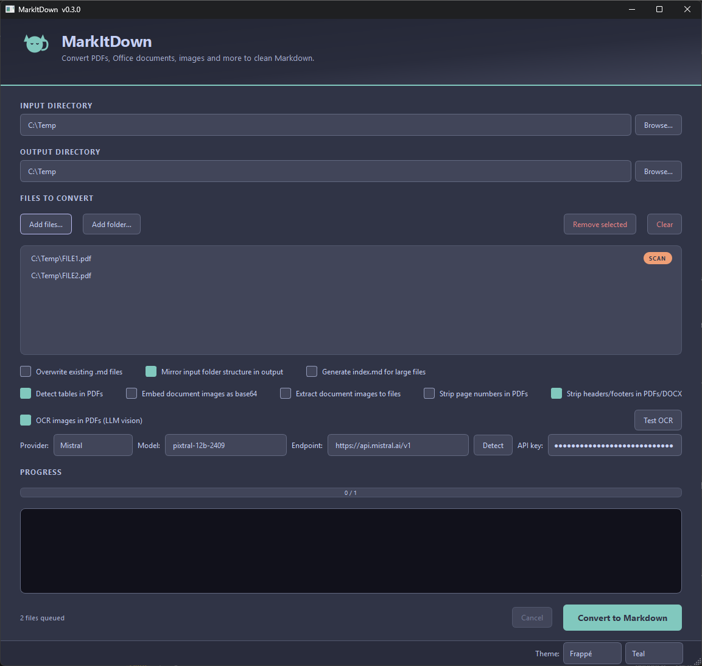

# MarkItDown GUI — Catppuccin



A Windows desktop GUI for batch-converting PDFs, Office documents, images,
audio, HTML, EPUB and more into clean Markdown. Built on top of Microsoft's
[MarkItDown](https://github.com/microsoft/markitdown) library with five
extras layered on top:

1. **Table-aware PDF conversion** — proper `| col | col |` Markdown tables
   instead of a vertical list of cells.
2. **Heading detection from PDF font sizes** — large-font lines become
   `## headings` so the output has real document structure.
3. **Sidecar `<name>.index.md`** — for outputs over ~500 lines, a navigation
   index is written next to the main file so an LLM can jump straight to the
   relevant section without reading the whole thing.
4. **Scanned-PDF detection + smart routing** — files identified as scanned
   are tagged with a SCAN badge in the file list and routed through the OCR
   converter; everything else takes the fast text path.
5. **Provider preset dropdown + local LLM discovery** — one-click setup for
   OpenAI, Azure, Google Gemini, Groq, OpenRouter, Mistral, LM Studio, and
   Ollama; a Detect button probes localhost for running servers and lists
   their vision-capable models.

The UI is themed with [Catppuccin](https://github.com/catppuccin/catppuccin),
defaulting to **Mocha** with a **Mauve** accent. All four flavors
(Latte / Frappé / Macchiato / Mocha) plus nine accents are selectable at
runtime from the status-bar dropdowns; the choice persists to `config.json`.

---

## Features

### Batch conversion
- Pick individual files or recurse into a folder
- Input / output directory pickers with auto-suggested output path
- Mirror folder structure (preserve subdirectories) or flatten
- Overwrite protection — opt in to replace existing `.md` files
- Background thread keeps the UI responsive; cancel any time
- Live progress bar + dark conversion log (Catppuccin Crust panel, terminal-style)
- All settings auto-persist to a JSON config file (see [Configuration](#configuration))

### Supported input formats *(from upstream MarkItDown)*
PDF, DOCX, PPTX, XLSX/XLS, CSV/TSV, HTML, XML/JSON, RTF, EPUB,
PNG/JPG/BMP/TIFF/GIF, MP3/WAV/M4A/FLAC, ZIP, and more.

### Detect tables in PDFs *(on by default)*
- Uses `pdfplumber.find_tables()` with strict line-based detection
- Post-processes each detected table:
  - Drops empty columns
  - Merges zebra-striped row pairs (alternating rows with complementary cells)
  - Collapses mutually exclusive adjacent column pairs (caused by header
    indentation)
  - Rejects 1-column boxes and prose-heavy "tables"
- Promotes large-font lines to `# / ## / ### headings`

### Generate index.md for large files *(on by default)*
- Triggers only when the output is over ~500 lines
- Scans for:
  - Markdown headings (`#` through `######`)
  - Numbered sections (`1`, `1.1`, `1.1.2`)
  - Named sections (`Chapter X`, `Appendix B`)
  - ALL CAPS short lines surrounded by blank/long lines
  - Title Case short lines preceded by blank, followed by prose
  - HTTP-style endpoints (`GET /api/...`, `Get method : /api/...`)
- Filters out repeated page headers/footers and code-like lines
- Groups endpoints by their first path segment

### Embed document images as base64 *(off by default)*
- Works on **PDF, DOCX, PPTX, XLSX, EPUB** — not just PDFs
- Each embedded image becomes an inline `data:` URI so the output stays
  self-contained (no sidecar files)
- **For PDFs, images are placed at their original on-page position** — the
  table-aware converter emits a placeholder at each image's y-coordinate
  and the post-processor swaps it for a real `data:` URI. This requires
  *Detect tables in PDFs*, which is auto-ticked when you enable an image
  mode
- For DOCX, MarkItDown's `mammoth` converter emits *truncated*
  `` placeholders with no real bytes — the
  rewriter substitutes the real base64 pulled from `word/media/` in document
  order so the resulting `data:` URIs actually display at the right place
- For PPTX / XLSX / EPUB (where MarkItDown drops images entirely), the
  rewriter pulls them straight from the source ZIP and appends an
  **Embedded images** section (no on-page coordinates available for these)
- Runs as a post-processing step, so it composes with table detection and OCR

### Extract document images to files *(off by default)*
- Works on **PDF, DOCX, PPTX, XLSX, EPUB** — not just PDFs
- Writes each embedded image to an `images/` subfolder next to the output
  `.md` and links it with a relative path
- **For PDFs, links are placed at the original on-page position** of each
  image, interleaved with the surrounding text and tables. Requires
  *Detect tables in PDFs* (auto-ticked when you enable this mode)
- PDFs are rasterised to PNG via PyMuPDF; other formats preserve the original
  bytes and file extension (`.png`, `.jpg`, etc.) so nothing is re-encoded
- For DOCX, every truncated `` placeholder
  MarkItDown emits is rewritten **in place** to point at the on-disk file —
  no broken `base64...` URIs are left in the output
- Identical images are deduped — by **PDF xref** (one PNG per unique image,
  shared across every page reference) for PDFs, by **SHA-256 of the bytes**
  for OOXML / EPUB (a logo referenced 50× becomes one file)
- Filenames are prefixed with the `.md` stem so several documents can share
  one `images/` folder without colliding (`<stem>_x<xref>.png` for PDFs,
  `<stem>_image<N>.<ext>` for OOXML / EPUB)
- Mutually exclusive with the base64 option — ticking one clears the other

### Scanned-PDF detection *(automatic)*
- Every queued PDF is probed asynchronously after being added
- Pages with images but no extractable text are counted as scanned
- A file is tagged with a **SCAN** badge (Amplify-orange pill) if ≥ 80% of
  pages are scanned
- The badge tells the converter to route the file through OCR; non-scanned
  files skip OCR entirely (no wasted LLM calls)

### OCR images in PDFs *(optional)*
- Uses Microsoft's `markitdown-ocr` plugin with any OpenAI-compatible vision
  model — including OpenAI, Azure, Google Gemini, Groq, OpenRouter, Mistral,
  LM Studio, and Ollama
- **Provider preset dropdown** — pick a provider and the endpoint + a known
  vision model fill in automatically
- **Test OCR button** — sends a tiny "Hello" image and shows the response
  (or error with diagnostic hints) so you can verify your setup without
  converting a real file
- **Detect button** — probes localhost on the standard ports (LM Studio
  1234, Ollama 11434, vLLM 8000, llama.cpp 8080, TGW 5000), filters the
  returned model list against ~50 known vision-model patterns
- Endpoint URLs auto-normalise: `http://localhost:1234` → `…/v1`
- Per-page progress log so you can watch a long scanned-PDF conversion
- 120s per-request timeout so a stuck call doesn't freeze the run
- Failed pages emit explicit `*[OCR failed: <error>]*` markers — never silent

---

## Install

Requires **Python 3.10+** (tested on 3.14, Windows 11).

```powershell
git clone <this-repo>
cd markitdown_gui
python -m venv .venv
.venv\Scripts\Activate.ps1
pip install .
```

This installs a `markitdown-gui` command on your PATH (a `pythonw.exe`-based
launcher on Windows, so no console window appears behind the Qt UI).

For development, use an editable install so source edits take effect
without re-running pip:

```powershell
pip install -e .
```

The dependency list (declared in [`pyproject.toml`](pyproject.toml)) pulls
`PySide6`, a curated set of MarkItDown extras
(`markitdown[pdf,docx,xlsx,xls,pptx,outlook,audio-transcription]`),
`markitdown-ocr`, and `openai`. `markitdown[all]` is **deliberately
avoided** — it pins `youtube-transcript-api~=1.0.0`, every 1.0.x release
of which declares `Requires-Python <3.14`, so `[all]` cannot resolve on
Python 3.14. The curated set covers every format the GUI actually
surfaces (PDF, DOCX, XLSX/XLS, PPTX, .msg, audio); EPUB / HTML / CSV
need no extra. `markitdown-ocr` and `openai` are only used by the OCR
feature; the rest of the app runs fine without them — use
`pip install --no-deps .` and curate manually if you want a leaner
footprint.

---

## Run

```powershell
markitdown-gui
```

(or `python -m app.main` if you'd rather not rely on the entry point.)

The vendored MarkItDown source lives under [`markitdown/`](markitdown/).
`pip install .` pulls the public PyPI packages by default, which is
sufficient for the GUI. To run against the vendored copy instead (e.g.
while modifying it), install both packages editable:

```powershell
pip install -e markitdown\packages\markitdown
pip install -e markitdown\packages\markitdown-ocr   # optional, for OCR
```

The vendored `markitdown-ocr` includes **local patches** (clearly marked
with `# Local patch (markitdown_gui):`) that fix the scanned-PDF OCR
fallback, surface per-image errors, add per-page progress callbacks, and
add a per-request timeout. The patches are non-invasive and the rest of
upstream is unchanged.

---

## Using the GUI

### 1. Pick input + output
Pick an **input directory** — the output dir auto-fills to
`<input>/markdown_output` (editable). Pick an **output directory** if you
want it elsewhere.

### 2. Queue files
**Add files…** or **Add folder…** to populate the queue. "Add folder" pulls
every supported file recursively. As PDFs are added they're probed for
scan-vs-text status in the background; scanned ones get a **SCAN** badge.

### 3. Toggle options
- *Overwrite existing .md files* — needed if you re-run a conversion.
- *Mirror input folder structure in output* — preserves subdirectories.
- *Detect tables in PDFs* — uses the table-aware converter. Auto-ticked
  whenever an image mode is enabled, since inline image placement is
  driven by the same converter.
- *Embed document images as base64* — embeds images (PDF, DOCX, PPTX, XLSX,
  EPUB) inline as real `data:` URIs. For PDFs the URI lands at the
  image's original on-page position; other formats append (no coordinates
  available). Off by default.
- *Extract document images to files* — writes embedded images to an `images/`
  subfolder and links them with relative paths. For PDFs the links land
  inline at the original on-page position; other formats append. Dedupes
  by PDF xref (PDFs) or SHA-256 (OOXML / EPUB). Off by default; mutually
  exclusive with base64.
- *Generate index.md for large files* — only fires for outputs > 500 lines.
- *Strip page numbers in PDFs* — removes isolated page-number lines
  (`5`, `- 5 -`, `Page 5 of 20`) left as their own paragraphs. PDF-only.
- *Strip headers/footers in PDFs/DOCX* — removes lines that repeat 3+ times
  across the document (a running banner or title bar). Works for PDF page
  furniture and for DOCX files that carry the same banner typed into the
  body of every page (e.g. DOCX exported from PDF); real Word header/footer
  objects never reach the markdown in the first place, so there's nothing
  to strip there.

### 4. OCR (optional)

Tick **"OCR images in PDFs (LLM vision)"** to enable. With OCR on:

- **Files with the SCAN badge** route through the LLM vision model
- **Everything else** still uses the fast text converter — no LLM calls

The OCR row has 4 inputs:

| Field | What it does |
|---|---|
| **Provider** | One-click presets for OpenAI / Azure / Google / Groq / OpenRouter / Mistral / LM Studio / Ollama. Picking one fills Endpoint + Model. |
| **Model** | Editable dropdown. Manually type any model name, or pick from the list (populated by **Detect** for local servers). |
| **Endpoint** | Auto-normalised — bare URLs like `http://localhost:1234` get `/v1` appended. Click **Detect** to probe localhost and pick a running server. |
| **API key** | Paste your provider key. Leave blank to use the `OPENAI_API_KEY` environment variable. For LM Studio / Ollama any value works (or leave blank — auto-set to `not-needed`). |

Two buttons:

- **Detect** — probes ports 1234, 11434, 8000, 8080, 5000. If a server is
  found, fills Endpoint + populates the Model dropdown with its
  vision-capable models. If no vision models are available, shows install
  commands (e.g. `ollama pull moondream`).
- **Test OCR** — sends a 200×80 "Hello" image to the configured model.
  Returns one of:
  - ✅ Model echoed "Hello" — setup works
  - ⚠ Model replied empty / unrelated — model probably isn't vision-capable
  - ❌ Error with diagnostic hint (connection refused, 401, 404, OOM, timeout)

### 5. Convert
Hit **Convert to Markdown** (purple CTA, bottom right). For each input you
get:

- `<name>.md` — main Markdown output
- `<name>.index.md` — sidecar navigation index (when enabled + file > 500 lines)

---

## Provider quick reference

The Provider dropdown ships these defaults. Click one and the endpoint + a
default vision model fill in; paste your key and you're ready.

| Provider | Endpoint | Default model | Key acquisition |
|---|---|---|---|
| OpenAI | `https://api.openai.com/v1` | `gpt-4o` | https://platform.openai.com/api-keys |
| **Google Gemini** | `https://generativelanguage.googleapis.com/v1beta/openai/` | `gemini-2.0-flash` | **Free tier** — https://aistudio.google.com/apikey |
| **Groq** | `https://api.groq.com/openai/v1` | `meta-llama/llama-4-scout-17b-16e-instruct` | **Free tier** — https://console.groq.com/keys |
| **OpenRouter** | `https://openrouter.ai/api/v1` | `google/gemini-2.0-flash-exp:free` | Some **free** models — https://openrouter.ai/keys |
| **Mistral** | `https://api.mistral.ai/v1` | `pixtral-12b-2409` | **Free "Experiment" tier** — https://console.mistral.ai/api-keys |
| Azure OpenAI | `https://YOUR-RESOURCE.openai.azure.com/openai/v1` | `gpt-4o` | Use your Azure resource API key + deployment name |
| LM Studio (local) | `http://localhost:1234/v1` | — (use Detect) | No key needed |
| Ollama (local) | `http://localhost:11434/v1` | — (use Detect) | No key needed |

**Recommended for first-time setup:** **Google Gemini** or **Mistral** — both
have generous free tiers and work out of the box once you paste an API key.

**For low-RAM local setups:** `ollama pull moondream` (≈ 1.5 GB) is the
smallest reliable vision model.

---

## Configuration

All UI state auto-saves to a JSON config file the moment you change it
(debounced to 500 ms). Loaded on startup.

**Path:** `%LOCALAPPDATA%\MarkItDown\MarkItDown\config.json` *(Windows)*

On first launch after the Catppuccin rebrand, an existing config at the
legacy `%LOCALAPPDATA%\Visma\MarkItDown\config.json` location is migrated
automatically — your API keys and preferences survive the change.

```json
{
  "detect_tables": true,
  "embed_images": false,
  "extract_images": false,
  "generate_index": true,
  "input_dir": "C:\\Users\\you\\Downloads",
  "mirror": true,
  "ocr": {
    "api_key": "your-api-key-here",
    "enabled": true,
    "endpoint": "https://api.mistral.ai/v1",
    "model": "pixtral-12b-2409",
    "provider": "Mistral"
  },
  "output_dir": "C:\\Users\\you\\Downloads\\markdown_output",
  "overwrite": false,
  "theme": {
    "flavor": "mocha",
    "accent": "mauve"
  }
}
```

**The API key is stored in plain text.** Same as every other GUI tool with a
"Save API key" checkbox. If you don't want it on disk:

- Leave the API key field blank and set the `OPENAI_API_KEY` environment
  variable instead — every provider preset accepts it.
- Or delete `config.json` after each session (clears everything, not just
  the key).

The file is human-editable. Delete it any time to start clean.

---

## Architecture

```
app/
  main.py                 # QApplication entry point (`markitdown-gui` / `python -m app.main`)
  main_window.py          # MainWindow + FileListDelegate (SCAN badge)
  worker.py               # ConversionWorker (QThread), OcrConfig, per-file routing
  pdf_table_converter.py  # PdfPlumberTableConverter — tables + font-size headings
  pdf_image_extractor.py  # Image extraction + inline-URI rewriting for PDF/OOXML/EPUB
  markdown_cleanup.py     # strip_empty_headings() — kills MD042 violations
  indexer.py              # build_index() — sidecar <name>.index.md generator
  scan_detector.py        # Async pdfplumber-based scanned-PDF detection
  llm_discovery.py        # Provider presets + local LLM probing
  config.py               # JSON config load/save (QStandardPaths)
  theme.py                # Catppuccin palettes (4 flavors) + Qt stylesheet + cat hero icon
markitdown/               # Vendored upstream MarkItDown source (see Credits)
  packages/
    markitdown/           # The core library imported by the GUI
    markitdown-ocr/       # LLM-vision OCR plugin (with local patches)
  LICENSE                 # Upstream MIT license (preserved)
  README.md               # Upstream documentation (preserved)
pyproject.toml            # Build metadata + dependencies + `markitdown-gui` entry point
requirements.txt          # Legacy install path; pyproject.toml is the source of truth
README.md                 # This file
```

### How the table-aware PDF converter works

`PdfPlumberTableConverter` (registered at priority `-1.0` so it wins over
the default `PdfConverter` for `.pdf` inputs) does this per page:

1. **Detect body font size** — modal char size from `page.chars`.
2. **Find ruled tables** with `vertical_strategy="lines"` and
   `horizontal_strategy="lines"` only — text-based detection produces
   phantom columns on zebra-shaded rows.
3. **Clean each detected table**:
   - Drop empty columns
   - Merge zebra-striped row pairs (alternating complementary cells)
   - Merge adjacent column pairs whose non-empty cells are mutually
     exclusive per row (caused by header indentation)
   - Reject 1-column "tables" (bordered text boxes) and prose-heavy ones
4. **Render the page in reading order** — text bands above, between, and
   below tables. When the converter is constructed with
   `inline_images=True` (the worker sets this whenever an image mode is on),
   image bboxes from PyMuPDF are treated as zero-height obstacles alongside
   tables, so each image's `<!--MDGUI_IMG:x<xref>:w<w>:h<h>-->` placeholder
   lands at its exact y-position between the surrounding text bands.
5. **Promote heading lines** by font-size ratio against body:
   `≥ 1.8× → # heading`, `≥ 1.45× → ##`, `≥ 1.2× → ###`.
6. **Filter heading noise** — < 3 alphabetic chars or contains `|` → skip.

### Empty-heading cleanup *(always on)*

mammoth (MarkItDown's `.docx` converter) emits two patterns that fail
markdownlint's `MD042 / no-empty-headings` rule:

- A bare `#` / `##` on a line by itself — comes from a Word paragraph
  styled as *Heading X* that the author left empty.
- `## ` — a heading whose entire content is an inline image,
  with no navigable text.

`markdown_cleanup.strip_empty_headings()` runs unconditionally after all
image post-processing and before the file is written. It deletes the first
pattern outright and demotes the second to a bare image (the image
survives, only the heading prefix is removed). A real Word DOCX dump
typically loses ~20 headings to this pass.

### How document image extraction works

`pdf_image_extractor.py` runs as a post-processing step on `text_content`
after MarkItDown finishes. It branches by source format and by mode:

| Source | What MarkItDown emits | What the extractor does |
|---|---|---|
| PDF *(with Detect tables on)* | `text_content` already contains `<!--MDGUI_IMG:...-->` placeholders emitted by `PdfPlumberTableConverter` at each image's on-page y-position | Replaces every placeholder with a real `` URI (embed mode) or `` link (file mode). One file or base64 blob per unique `xref`; multiple page references share it. |
| PDF *(Detect tables off — fallback)* | Text only | Walks the PDF via PyMuPDF, dedupes by `xref`, appends an **Embedded images** section grouped by page (base64) or rasterises to PNG files (file mode). |
| DOCX | Text + **truncated** `` placeholders per image-reference | Reads `word/media/` from the ZIP, sorts by trailing image number, then rewrites each placeholder in document order — to the real base64 bytes (embed mode) or to an on-disk file path (file mode). |
| PPTX / XLSX / EPUB | Text only; images dropped | Reads `ppt/media/`, `xl/media/`, or walks the EPUB ZIP by image extension. Appends an **Embedded images** section (no on-page coordinates available). |
| Other (txt, html, csv…) | Text only | Logs `image extraction not supported for '<ext>' files` and exits cleanly. |

In file mode, identical images share one file on disk — by **PDF xref**
for PDFs (a logo referenced 50× across every page becomes one PNG referenced
50×) or by **SHA-256 of the decoded bytes** for OOXML / EPUB. Filenames are
prefixed with the output `.md` stem so multiple documents can write into the
same `images/` folder without collision.

PyMuPDF (`fitz`) is only required for the PDF branch; the OOXML and EPUB
branches use Python's stdlib `zipfile` and `hashlib` only.

### How per-file converter routing works

`ConversionWorker._build_converters()` returns `(text_md, ocr_md)`:

- `text_md` — standard MarkItDown + `PdfPlumberTableConverter` at -1.0
- `ocr_md` — MarkItDown with `enable_plugins=True` and the OCR plugin
  registered; built only when OCR is on **and** at least one queued file is
  scanned

Each item is then routed by `_pick_converter()`:

| OCR checkbox | File is scanned | Route |
|---|---|---|
| Off | any | `text_md` |
| On | yes | `ocr_md` (LLM vision) |
| On | no | `text_md` (no LLM calls) |

The log shows the chosen route per file: `Converting [OCR]: …` or
`Converting [text]: …`.

### How the indexer works

`build_index(markdown, source_name)` scans the converted file for:

- Markdown headings (`#` through `######`)
- Numbered sections (`1`, `1.1`, `1.1.2`)
- Named sections (`Chapter`, `Section`, `Part`, `Appendix`, `Annex`)
- ALL CAPS short lines surrounded by blank/long lines
- Title Case short lines preceded by blank, followed by prose
- HTTP-style endpoints — both `GET /api/...` and `Get method : /api/...`

Page headers/footers are detected by repetition count (any non-trivial line
appearing 4+ times is treated as boilerplate) and filtered. Code-like lines
containing `() {} [] = ; * | / \ " ' \`` are rejected from heuristic
heading detection.

Endpoints are grouped by their first path segment (`/api/account/...` →
`account`).

### Vendored markitdown-ocr patches

Three local patches in [`markitdown/packages/markitdown-ocr/`](markitdown/packages/markitdown-ocr/),
each annotated with `# Local patch (markitdown_gui):` comments:

1. **`_pdf_converter_with_ocr.py`** — surfaces `ocr_result.error` in the
   per-page placeholder (`*[OCR failed: <error>]*`) instead of silently
   discarding it. Adds a no-content placeholder when the model returns
   blank. Adds a module-level progress callback for per-page UI updates.
   Fixes a bug where pre-added page headers prevented the full-page OCR
   fallback from triggering on fully-scanned PDFs.
2. **`_ocr_service.py`** — adds a `timeout=120` to the LLM call so a stuck
   request fails fast instead of freezing the conversion.

---

## Troubleshooting

| Symptom | Likely cause / fix |
|---|---|
| Test OCR: `APIConnectionError: Connection error` | Local server not running, or endpoint missing `/v1`. The endpoint auto-corrects on Test/Convert, but check that LM Studio's "Local Server" is started and a model is loaded. |
| Test OCR: model replies empty / "I cannot see images" | Model isn't vision-capable. Pick one from the Provider preset, or pull a vision model: `ollama pull moondream`. |
| Test OCR: `model requires more system memory` | Picked model is too large for your RAM. Try `moondream` (1.5 GB), `minicpm-v` (3 GB), or `gemma3:4b` (3 GB). |
| Scanned PDF output is just `## Page 1`, `## Page 2`, … | You're running an unpatched `markitdown-ocr` from PyPI. Install the vendored copy: `pip install -e markitdown\packages\markitdown-ocr`. |
| OCR feels like it hangs | It's grinding through pages serially. Watch the log — you'll see `OCR page N/total…`. Each call takes 5-30 s on free tiers. |
| "OCR was requested but markitdown-ocr is not installed" | Run `pip install markitdown-ocr openai`. |
| File written but content is `*[OCR failed: ...]*` per page | Read the error message in the placeholder — auth, model, or rate-limit issue. Use Test OCR to verify the setup. |

---

## Credits

This project is a thin Catppuccin-themed GUI wrapper around the excellent
work done by the Microsoft AutoGen team:

- **[MarkItDown](https://github.com/microsoft/markitdown)** — the core
  file-to-Markdown conversion library (MIT, © Microsoft Corporation). The
  source is vendored under [`markitdown/`](markitdown/), with the upstream
  [`LICENSE`](markitdown/LICENSE) and [`README.md`](markitdown/README.md)
  preserved.
- **[markitdown-ocr](markitdown/packages/markitdown-ocr/)** — LLM-vision OCR
  plugin (MIT). Vendored with small local patches (clearly marked) for
  scanned-PDF handling, per-page progress, and per-request timeout.

The GUI layer (`app/`), the `PdfPlumberTableConverter`, the indexer, the
scan detector, the local-LLM discovery, the provider presets, and the
config persistence are original code written for this project.

### Third-party libraries

- **[PySide6](https://wiki.qt.io/Qt_for_Python)** (LGPL-3.0) — Qt for Python
- **[pdfplumber](https://github.com/jsvine/pdfplumber)** (MIT) — table
  detection + scanned-PDF probing
- **[pdfminer.six](https://github.com/pdfminer/pdfminer.six)** (MIT) —
  fallback PDF text extraction
- **[openai](https://github.com/openai/openai-python)** (Apache 2.0) —
  OpenAI-compatible client (only when OCR is enabled)
- **[PyMuPDF](https://github.com/pymupdf/PyMuPDF)** (AGPL) — used by
  markitdown-ocr for rendering pages of malformed PDFs

---

## License

The GUI code in this repository (`app/`, `pyproject.toml`, this README)
is MIT-licensed. The vendored MarkItDown source remains under its own MIT
license — see [`markitdown/LICENSE`](markitdown/LICENSE).

Note that PyMuPDF (pulled in transitively by `markitdown-ocr`) is AGPL —
relevant if you redistribute compiled binaries; not an issue for source
distribution.

---

## Theme

The UI is themed with [Catppuccin](https://github.com/catppuccin/catppuccin),
a soothing pastel theme that ships four flavors:

| Flavor | Type | Best for |
|---|---|---|
| **Latte** | Light | Daytime work, high-ambient-light environments |
| **Frappé** | Dark, warm | Soft dark mode, lowest contrast of the dark trio |
| **Macchiato** | Dark, medium | Balanced dark mode |
| **Mocha** | Dark, deepest | High-contrast dark mode — **the default** |

Nine accents are selectable: **Mauve** (default), Blue, Lavender, Peach,
Pink, Teal, Sky, Green, Rosewater. The accent drives the primary CTA, the
file-list selection, focus rings, progress bar, and the cat silhouette in
the hero.

Both pickers live in the **status bar (bottom-right)**:

> *Theme:* [`Mocha ▾`] [`Mauve ▾`]

Changes apply instantly and persist to `config.json`. Colours are assigned
by semantic role (Base / Surface / Text / Accent / etc.) — not by hex code —
so swapping a flavor preserves the contrast hierarchy automatically. See
[`app/theme.py`](app/theme.py) for the palette definitions and the QSS
builder.

The SCAN badge on scanned PDFs uses the **Peach** colour (warn-without-alarm
semantics, similar to Yellow) regardless of accent — it shouldn't fight with
the user's chosen primary colour.

### Attribution

> Theme: [Catppuccin](https://github.com/catppuccin/catppuccin) — MIT-licensed.
