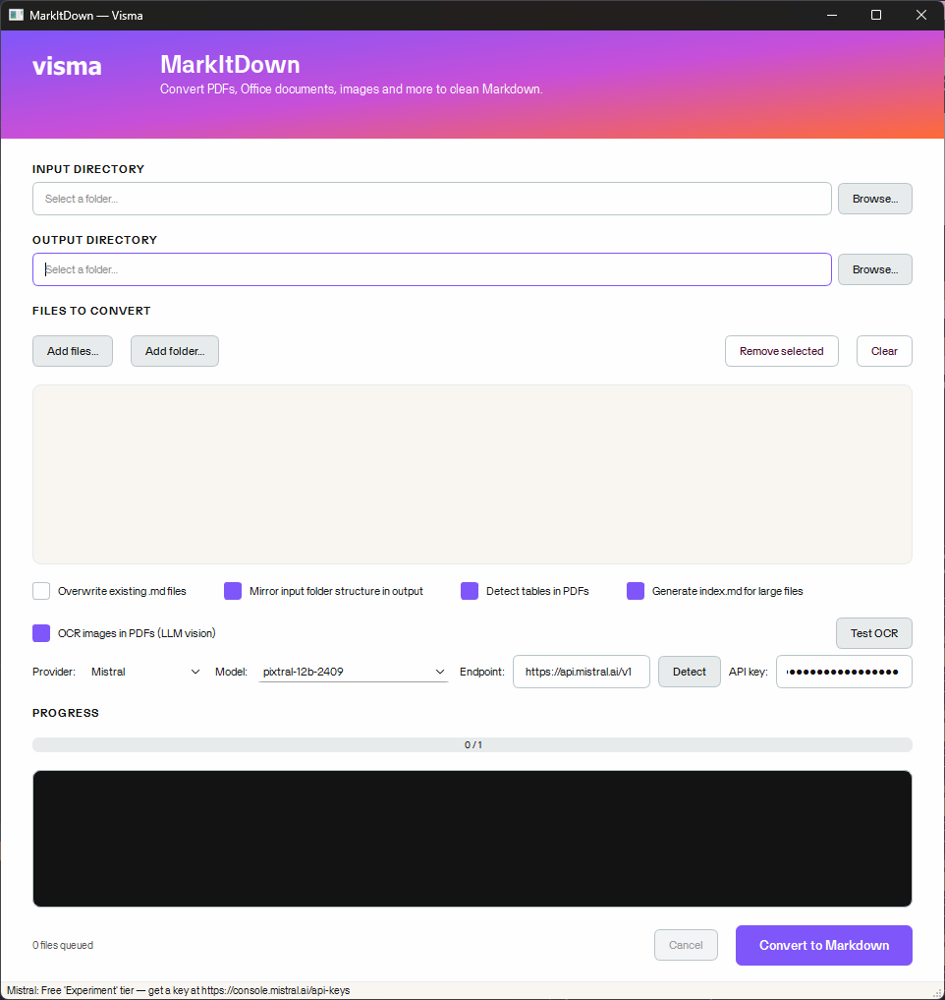

# MarkItDown GUI — Visma



A Windows desktop GUI for batch-converting PDFs, Office documents, images,
audio, HTML, EPUB and more into clean Markdown. Built on top of Microsoft's
[MarkItDown](https://github.com/microsoft/markitdown) library with five
extras layered on top:

1. **Table-aware PDF conversion** — proper `| col | col |` Markdown tables
   instead of a vertical list of cells.
2. **Heading detection from PDF font sizes** — large-font lines become
   `## headings` so the output has real document structure.
3. **Sidecar `<name>.index.md`** — for outputs over ~500 lines, a navigation
   index is written next to the main file so an LLM can jump straight to the
   relevant section without reading the whole thing.
4. **Scanned-PDF detection + smart routing** — files identified as scanned
   are tagged with a SCAN badge in the file list and routed through the OCR
   converter; everything else takes the fast text path.
5. **Provider preset dropdown + local LLM discovery** — one-click setup for
   OpenAI, Azure, Google Gemini, Groq, OpenRouter, Mistral, LM Studio, and
   Ollama; a Detect button probes localhost for running servers and lists
   their vision-capable models.

The UI follows the Visma brand: Visma Purple primary action, Amplify gradient
hero band, Visma Text typography, white-dominant body.

---

## Features

### Batch conversion
- Pick individual files or recurse into a folder
- Input / output directory pickers with auto-suggested output path
- Mirror folder structure (preserve subdirectories) or flatten
- Overwrite protection — opt in to replace existing `.md` files
- Background thread keeps the UI responsive; cancel any time
- Live progress bar + dark conversion log (Visma Black panel)
- All settings auto-persist to a JSON config file (see [Configuration](#configuration))

### Supported input formats *(from upstream MarkItDown)*
PDF, DOCX, PPTX, XLSX/XLS, CSV/TSV, HTML, XML/JSON, RTF, EPUB,
PNG/JPG/BMP/TIFF/GIF, MP3/WAV/M4A/FLAC, ZIP, and more.

### Detect tables in PDFs *(on by default)*
- Uses `pdfplumber.find_tables()` with strict line-based detection
- Post-processes each detected table:
  - Drops empty columns
  - Merges zebra-striped row pairs (alternating rows with complementary cells)
  - Collapses mutually exclusive adjacent column pairs (caused by header
    indentation)
  - Rejects 1-column boxes and prose-heavy "tables"
- Promotes large-font lines to `# / ## / ### headings`

### Generate index.md for large files *(on by default)*
- Triggers only when the output is over ~500 lines
- Scans for:
  - Markdown headings (`#` through `######`)
  - Numbered sections (`1`, `1.1`, `1.1.2`)
  - Named sections (`Chapter X`, `Appendix B`)
  - ALL CAPS short lines surrounded by blank/long lines
  - Title Case short lines preceded by blank, followed by prose
  - HTTP-style endpoints (`GET /api/...`, `Get method : /api/...`)
- Filters out repeated page headers/footers and code-like lines
- Groups endpoints by their first path segment

### Scanned-PDF detection *(automatic)*
- Every queued PDF is probed asynchronously after being added
- Pages with images but no extractable text are counted as scanned
- A file is tagged with a **SCAN** badge (Amplify-orange pill) if ≥ 80% of
  pages are scanned
- The badge tells the converter to route the file through OCR; non-scanned
  files skip OCR entirely (no wasted LLM calls)

### OCR images in PDFs *(optional)*
- Uses Microsoft's `markitdown-ocr` plugin with any OpenAI-compatible vision
  model — including OpenAI, Azure, Google Gemini, Groq, OpenRouter, Mistral,
  LM Studio, and Ollama
- **Provider preset dropdown** — pick a provider and the endpoint + a known
  vision model fill in automatically
- **Test OCR button** — sends a tiny "Hello" image and shows the response
  (or error with diagnostic hints) so you can verify your setup without
  converting a real file
- **Detect button** — probes localhost on the standard ports (LM Studio
  1234, Ollama 11434, vLLM 8000, llama.cpp 8080, TGW 5000), filters the
  returned model list against ~50 known vision-model patterns
- Endpoint URLs auto-normalise: `http://localhost:1234` → `…/v1`
- Per-page progress log so you can watch a long scanned-PDF conversion
- 120s per-request timeout so a stuck call doesn't freeze the run
- Failed pages emit explicit `*[OCR failed: <error>]*` markers — never silent

---

## Install

Requires **Python 3.10+** (tested on 3.14, Windows 11).

```powershell
git clone <this-repo>
cd markitdown_gui
python -m venv .venv
.venv\Scripts\Activate.ps1
pip install -r requirements.txt
```

`markitdown[all]` pulls every optional dependency (PDF, DOCX, XLSX, PPTX,
audio, EPUB, …). To slim down, edit `requirements.txt` and replace it with
e.g. `markitdown[pdf,docx,xlsx]`.

`markitdown-ocr` and `openai` are only needed for the OCR feature; the rest
of the app runs fine without them.

---

## Run

```powershell
python -m app.main
```

The vendored MarkItDown source lives under [`markitdown/`](markitdown/). The
`requirements.txt` installs the public PyPI package by default, which is
sufficient for the GUI. To run against the vendored copy instead (e.g. while
modifying it), install both packages editable:

```powershell
pip install -e markitdown\packages\markitdown
pip install -e markitdown\packages\markitdown-ocr   # optional, for OCR
```

The vendored `markitdown-ocr` includes **local patches** (clearly marked
with `# Local patch (markitdown_gui):`) that fix the scanned-PDF OCR
fallback, surface per-image errors, add per-page progress callbacks, and
add a per-request timeout. The patches are non-invasive and the rest of
upstream is unchanged.

---

## Using the GUI

### 1. Pick input + output
Pick an **input directory** — the output dir auto-fills to
`<input>/markdown_output` (editable). Pick an **output directory** if you
want it elsewhere.

### 2. Queue files
**Add files…** or **Add folder…** to populate the queue. "Add folder" pulls
every supported file recursively. As PDFs are added they're probed for
scan-vs-text status in the background; scanned ones get a **SCAN** badge.

### 3. Toggle options
- *Overwrite existing .md files* — needed if you re-run a conversion.
- *Mirror input folder structure in output* — preserves subdirectories.
- *Detect tables in PDFs* — uses the table-aware converter.
- *Generate index.md for large files* — only fires for outputs > 500 lines.

### 4. OCR (optional)

Tick **"OCR images in PDFs (LLM vision)"** to enable. With OCR on:

- **Files with the SCAN badge** route through the LLM vision model
- **Everything else** still uses the fast text converter — no LLM calls

The OCR row has 4 inputs:

| Field | What it does |
|---|---|
| **Provider** | One-click presets for OpenAI / Azure / Google / Groq / OpenRouter / Mistral / LM Studio / Ollama. Picking one fills Endpoint + Model. |
| **Model** | Editable dropdown. Manually type any model name, or pick from the list (populated by **Detect** for local servers). |
| **Endpoint** | Auto-normalised — bare URLs like `http://localhost:1234` get `/v1` appended. Click **Detect** to probe localhost and pick a running server. |
| **API key** | Paste your provider key. Leave blank to use the `OPENAI_API_KEY` environment variable. For LM Studio / Ollama any value works (or leave blank — auto-set to `not-needed`). |

Two buttons:

- **Detect** — probes ports 1234, 11434, 8000, 8080, 5000. If a server is
  found, fills Endpoint + populates the Model dropdown with its
  vision-capable models. If no vision models are available, shows install
  commands (e.g. `ollama pull moondream`).
- **Test OCR** — sends a 200×80 "Hello" image to the configured model.
  Returns one of:
  - ✅ Model echoed "Hello" — setup works
  - ⚠ Model replied empty / unrelated — model probably isn't vision-capable
  - ❌ Error with diagnostic hint (connection refused, 401, 404, OOM, timeout)

### 5. Convert
Hit **Convert to Markdown** (purple CTA, bottom right). For each input you
get:

- `<name>.md` — main Markdown output
- `<name>.index.md` — sidecar navigation index (when enabled + file > 500 lines)

---

## Provider quick reference

The Provider dropdown ships these defaults. Click one and the endpoint + a
default vision model fill in; paste your key and you're ready.

| Provider | Endpoint | Default model | Key acquisition |
|---|---|---|---|
| OpenAI | `https://api.openai.com/v1` | `gpt-4o` | https://platform.openai.com/api-keys |
| **Google Gemini** | `https://generativelanguage.googleapis.com/v1beta/openai/` | `gemini-2.0-flash` | **Free tier** — https://aistudio.google.com/apikey |
| **Groq** | `https://api.groq.com/openai/v1` | `meta-llama/llama-4-scout-17b-16e-instruct` | **Free tier** — https://console.groq.com/keys |
| **OpenRouter** | `https://openrouter.ai/api/v1` | `google/gemini-2.0-flash-exp:free` | Some **free** models — https://openrouter.ai/keys |
| **Mistral** | `https://api.mistral.ai/v1` | `pixtral-12b-2409` | **Free "Experiment" tier** — https://console.mistral.ai/api-keys |
| Azure OpenAI | `https://YOUR-RESOURCE.openai.azure.com/openai/v1` | `gpt-4o` | Use your Azure resource API key + deployment name |
| LM Studio (local) | `http://localhost:1234/v1` | — (use Detect) | No key needed |
| Ollama (local) | `http://localhost:11434/v1` | — (use Detect) | No key needed |

**Recommended for first-time setup:** **Google Gemini** or **Mistral** — both
have generous free tiers and work out of the box once you paste an API key.

**For low-RAM local setups:** `ollama pull moondream` (≈ 1.5 GB) is the
smallest reliable vision model.

---

## Configuration

All UI state auto-saves to a JSON config file the moment you change it
(debounced to 500 ms). Loaded on startup.

**Path:** `%LOCALAPPDATA%\Visma\MarkItDown\config.json` *(Windows)*

```json
{
  "detect_tables": true,
  "generate_index": true,
  "input_dir": "C:\\Users\\you\\Downloads",
  "mirror": true,
  "ocr": {
    "api_key": "your-api-key-here",
    "enabled": true,
    "endpoint": "https://api.mistral.ai/v1",
    "model": "pixtral-12b-2409",
    "provider": "Mistral"
  },
  "output_dir": "C:\\Users\\you\\Downloads\\markdown_output",
  "overwrite": false
}
```

**The API key is stored in plain text.** Same as every other GUI tool with a
"Save API key" checkbox. If you don't want it on disk:

- Leave the API key field blank and set the `OPENAI_API_KEY` environment
  variable instead — every provider preset accepts it.
- Or delete `config.json` after each session (clears everything, not just
  the key).

The file is human-editable. Delete it any time to start clean.

---

## Architecture

```
app/
  main.py                 # QApplication entry point (`python -m app.main`)
  main_window.py          # MainWindow + FileListDelegate (SCAN badge)
  worker.py               # ConversionWorker (QThread), OcrConfig, per-file routing
  pdf_table_converter.py  # PdfPlumberTableConverter — tables + font-size headings
  indexer.py              # build_index() — sidecar <name>.index.md generator
  scan_detector.py        # Async pdfplumber-based scanned-PDF detection
  llm_discovery.py        # Provider presets + local LLM probing
  config.py               # JSON config load/save (QStandardPaths)
  theme.py                # Visma brand palette + Qt stylesheet
markitdown/               # Vendored upstream MarkItDown source (see Credits)
  packages/
    markitdown/           # The core library imported by the GUI
    markitdown-ocr/       # LLM-vision OCR plugin (with local patches)
  LICENSE                 # Upstream MIT license (preserved)
  README.md               # Upstream documentation (preserved)
requirements.txt
README.md                 # This file
```

### How the table-aware PDF converter works

`PdfPlumberTableConverter` (registered at priority `-1.0` so it wins over
the default `PdfConverter` for `.pdf` inputs) does this per page:

1. **Detect body font size** — modal char size from `page.chars`.
2. **Find ruled tables** with `vertical_strategy="lines"` and
   `horizontal_strategy="lines"` only — text-based detection produces
   phantom columns on zebra-shaded rows.
3. **Clean each detected table**:
   - Drop empty columns
   - Merge zebra-striped row pairs (alternating complementary cells)
   - Merge adjacent column pairs whose non-empty cells are mutually
     exclusive per row (caused by header indentation)
   - Reject 1-column "tables" (bordered text boxes) and prose-heavy ones
4. **Render the page in reading order** — text bands above, between, and
   below tables.
5. **Promote heading lines** by font-size ratio against body:
   `≥ 1.8× → # heading`, `≥ 1.45× → ##`, `≥ 1.2× → ###`.
6. **Filter heading noise** — < 3 alphabetic chars or contains `|` → skip.

### How per-file converter routing works

`ConversionWorker._build_converters()` returns `(text_md, ocr_md)`:

- `text_md` — standard MarkItDown + `PdfPlumberTableConverter` at -1.0
- `ocr_md` — MarkItDown with `enable_plugins=True` and the OCR plugin
  registered; built only when OCR is on **and** at least one queued file is
  scanned

Each item is then routed by `_pick_converter()`:

| OCR checkbox | File is scanned | Route |
|---|---|---|
| Off | any | `text_md` |
| On | yes | `ocr_md` (LLM vision) |
| On | no | `text_md` (no LLM calls) |

The log shows the chosen route per file: `Converting [OCR]: …` or
`Converting [text]: …`.

### How the indexer works

`build_index(markdown, source_name)` scans the converted file for:

- Markdown headings (`#` through `######`)
- Numbered sections (`1`, `1.1`, `1.1.2`)
- Named sections (`Chapter`, `Section`, `Part`, `Appendix`, `Annex`)
- ALL CAPS short lines surrounded by blank/long lines
- Title Case short lines preceded by blank, followed by prose
- HTTP-style endpoints — both `GET /api/...` and `Get method : /api/...`

Page headers/footers are detected by repetition count (any non-trivial line
appearing 4+ times is treated as boilerplate) and filtered. Code-like lines
containing `() {} [] = ; * | / \ " ' \`` are rejected from heuristic
heading detection.

Endpoints are grouped by their first path segment (`/api/account/...` →
`account`).

### Vendored markitdown-ocr patches

Three local patches in [`markitdown/packages/markitdown-ocr/`](markitdown/packages/markitdown-ocr/),
each annotated with `# Local patch (markitdown_gui):` comments:

1. **`_pdf_converter_with_ocr.py`** — surfaces `ocr_result.error` in the
   per-page placeholder (`*[OCR failed: <error>]*`) instead of silently
   discarding it. Adds a no-content placeholder when the model returns
   blank. Adds a module-level progress callback for per-page UI updates.
   Fixes a bug where pre-added page headers prevented the full-page OCR
   fallback from triggering on fully-scanned PDFs.
2. **`_ocr_service.py`** — adds a `timeout=120` to the LLM call so a stuck
   request fails fast instead of freezing the conversion.

---

## Troubleshooting

| Symptom | Likely cause / fix |
|---|---|
| Test OCR: `APIConnectionError: Connection error` | Local server not running, or endpoint missing `/v1`. The endpoint auto-corrects on Test/Convert, but check that LM Studio's "Local Server" is started and a model is loaded. |
| Test OCR: model replies empty / "I cannot see images" | Model isn't vision-capable. Pick one from the Provider preset, or pull a vision model: `ollama pull moondream`. |
| Test OCR: `model requires more system memory` | Picked model is too large for your RAM. Try `moondream` (1.5 GB), `minicpm-v` (3 GB), or `gemma3:4b` (3 GB). |
| Scanned PDF output is just `## Page 1`, `## Page 2`, … | You're running an unpatched `markitdown-ocr` from PyPI. Install the vendored copy: `pip install -e markitdown\packages\markitdown-ocr`. |
| OCR feels like it hangs | It's grinding through pages serially. Watch the log — you'll see `OCR page N/total…`. Each call takes 5-30 s on free tiers. |
| "OCR was requested but markitdown-ocr is not installed" | Run `pip install markitdown-ocr openai`. |
| File written but content is `*[OCR failed: ...]*` per page | Read the error message in the placeholder — auth, model, or rate-limit issue. Use Test OCR to verify the setup. |

---

## Credits

This project is a thin Visma-branded GUI wrapper around the excellent work
done by the Microsoft AutoGen team:

- **[MarkItDown](https://github.com/microsoft/markitdown)** — the core
  file-to-Markdown conversion library (MIT, © Microsoft Corporation). The
  source is vendored under [`markitdown/`](markitdown/), with the upstream
  [`LICENSE`](markitdown/LICENSE) and [`README.md`](markitdown/README.md)
  preserved.
- **[markitdown-ocr](markitdown/packages/markitdown-ocr/)** — LLM-vision OCR
  plugin (MIT). Vendored with small local patches (clearly marked) for
  scanned-PDF handling, per-page progress, and per-request timeout.

The GUI layer (`app/`), the `PdfPlumberTableConverter`, the indexer, the
scan detector, the local-LLM discovery, the provider presets, and the
config persistence are original code written for this project.

### Third-party libraries

- **[PySide6](https://wiki.qt.io/Qt_for_Python)** (LGPL-3.0) — Qt for Python
- **[pdfplumber](https://github.com/jsvine/pdfplumber)** (MIT) — table
  detection + scanned-PDF probing
- **[pdfminer.six](https://github.com/pdfminer/pdfminer.six)** (MIT) —
  fallback PDF text extraction
- **[openai](https://github.com/openai/openai-python)** (Apache 2.0) —
  OpenAI-compatible client (only when OCR is enabled)
- **[PyMuPDF](https://github.com/pymupdf/PyMuPDF)** (AGPL) — used by
  markitdown-ocr for rendering pages of malformed PDFs

---

## License

The GUI code in this repository (`app/`, `requirements.txt`, this README)
is MIT-licensed. The vendored MarkItDown source remains under its own MIT
license — see [`markitdown/LICENSE`](markitdown/LICENSE).

Note that PyMuPDF (pulled in transitively by `markitdown-ocr`) is AGPL —
relevant if you redistribute compiled binaries; not an issue for source
distribution.

---

## Brand notes

The hero band, primary CTA, and progress bar use the Visma Purple → Amplify
gradient. The wordmark in the hero is a placeholder rendered with the brand
font stack; for production builds, download the official Visma logo from
[design.visma.com](https://design.visma.com) and swap the
`visma_logo_svg()` call in [`app/theme.py`](app/theme.py) for the real asset.
